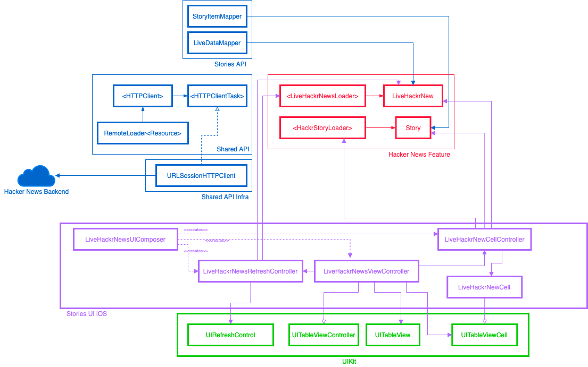
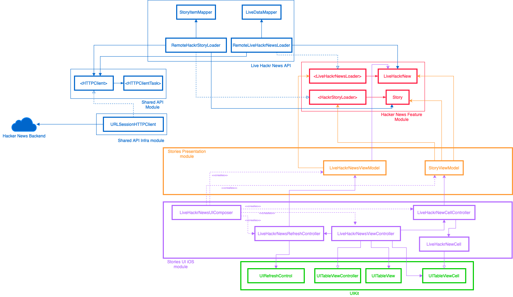

---

## About Hackr/News

A simple iOS client for Y Combinator's Hacker News.

## App Architecture

### Core modules

The core `Hackr News Feature` and API's modules are platform agnostic, so they can be reused.

##### MVC 

We started with a simple MVC approach, delegating responsabilities for refreshing, displaying cell information and managing cell controllers to its own components.

You can check the diff [here](https://github.com/AlfredoHernandez/HackrNews/pull/6)

##### MVVM 

In this approach we create a new platform agnostic `Stories Presentation` module, so they now can be reused by any platform. 

You can check the diff [here](https://github.com/AlfredoHernandez/HackrNews/pull/8)

## UX goals for the `New Stories` UI experience

- [X] Load stories automatically when view is presented
- [X] Allow customer to manually reload stories (pull to refresh)
- [X] Show a loading indicator while loading stories

### Stories loading experience

- [X] Render all loaded stories items (Title, Author, score, created at, total comments, url)
- [X] Load story when is near to be visible (on screen)
- [X] Cancel load story when is out of screen
- [X] Show a loading indicator while loading story (shimmer)
- [X] Option to retry load story in download error
- [X] Preload when story view is near visible