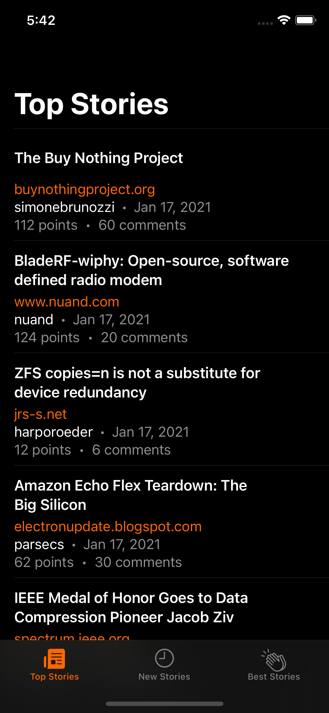
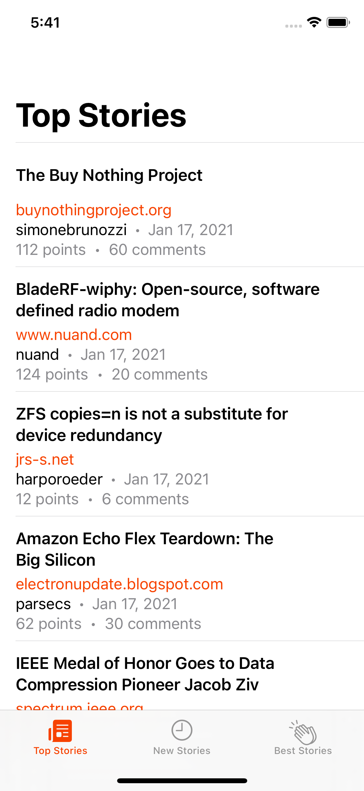

---

## About Hackr/News

Hackr/News is a **Y Combinator's** Hacker News reading app for iOS.

## How to build?

1. Clone this repo into your Mac.
2. Open the `HackrNewsApp.xcworkspace` file in Xcode.
3. Run the `HackerNewsApp` in your favorite iOS simulator.

## Snapshot Tests

**Please make sure use an `iPhone 12 Mini` simulator to run the snapshot tests. Otherwise tests will fail.**

## Screenshots

### iOS

### More docs

- [App architecture](./App_Architecture.md)
